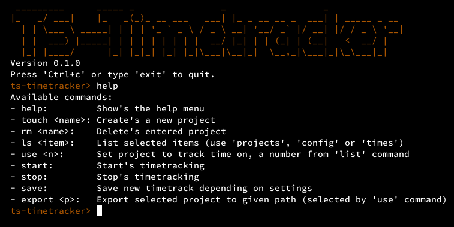

# ts-timetracker
Simple interactive command line timetracker.  
  

## Installation
Follow the steps below for installating:  
`$ git clone https://github.com/thomasschwarz96/ts-timetracker.git`  
`$ cd ts-timetracker`  
`$ cmake .`  
`$ make`  

## Unit tests
Follow the steps below for unit testing after the installation guide:  
`$ make test`  
`$ ./ts-test` or `$ ctest`  

## Configuration
Path of the config file: **~/.config/ts-timetracker/**  
Name of the config file: **ts-timetracker.conf**  
The config file will be generated automatically while installation.  

Possible config values:  
- `timeFormat=%d.%m.%Y %T` format is used for displaying time
- `projectsPath=.config/ts-timetracker/projects/` path is used for creating, saving and deleting projects
- `storage=filesystem` indicates which model should used
- `view=terminal` indicates which view should used

##### Available Models:
- filesystem: save's the data into files, location is configured by "projectsPath"

##### Available Views:
- terminal: run's in the terminal, with and simple interactive command line interface

## Contributing
Pull requests are welcome.  
For major changes, please open an issue first to discuss what you would like to change.  

Please make sure to update tests as appropriate.  
I appreciate every single help!

## ToDo
- [x] Create interface for models
- [ ] Improve filesystem model
- [ ] Create multiple small unit tests

## Libaries in usage
- For printing the table: https://github.com/friedmud/variadic_table

## License
[MIT-License](https://choosealicense.com/licenses/mit/)
